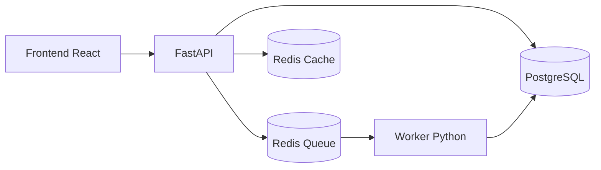

# StudyFlow Lab

Projeto pratico para estudar Kubernetes com uma arquitetura de microservicos usando:

- Frontend em React
- API em FastAPI
- Worker assincrono em Python
- Redis como fila e cache
- PostgreSQL como banco relacional
- Docker para empacotar tudo
- Kubernetes para orquestracao e escalabilidade

## Por que escolhi esse tema

Escolhi o **StudyFlow**, um gerador de planos de estudo, porque ele conversa com o momento em que voce esta agora: aprendendo na pratica e precisando visualizar bem cada componente do sistema. Esse tema deixa claro por que separar responsabilidades ajuda:

- o **frontend** recebe o pedido e mostra o status em tempo real
- a **API** valida e registra o pedido
- o **Redis** coloca o pedido em uma fila e ainda pode servir como cache
- o **worker** pega o item da fila e faz o processamento pesado sem travar a API
- o **PostgreSQL** guarda o historico e o resultado final
- o **Kubernetes** escala cada parte de forma independente

## O que o worker faz e por que ele existe

O worker e um processo separado da API. Ele serve para executar tarefas que nao devem travar a resposta HTTP do usuario.

Neste projeto, o fluxo e assim:

1. O usuario cria um pedido de plano de estudo no frontend.
2. A API salva esse pedido no PostgreSQL com status `pending`.
3. A API envia o `job_id` para uma fila no Redis.
4. O worker fica escutando essa fila.
5. Quando encontra um job, ele muda o status para `processing`, gera o plano de estudo e grava o resultado no PostgreSQL com status `completed`.

Na pratica, esse worker poderia ser usado para:

- gerar relatorios
- enviar emails
- processar imagens
- integrar com APIs externas
- exportar arquivos
- rodar tarefas demoradas

A vantagem disso no Kubernetes e enorme: voce pode escalar o worker separadamente da API. Se a fila crescer, basta aumentar replicas do worker sem precisar aumentar o frontend.

## Estrutura do projeto

```text
kubernetes/
|-- backend/
|   |-- app/
|   |   |-- api.py
|   |   |-- database.py
|   |   |-- models.py
|   |   |-- queue.py
|   |   |-- schemas.py
|   |   |-- services.py
|   |   |-- settings.py
|   |   `-- worker.py
|   |-- Dockerfile.api
|   |-- Dockerfile.worker
|   `-- requirements.txt
|-- frontend/
|   |-- nginx/
|   |-- src/
|   |-- Dockerfile
|   `-- package.json
|-- infra/
|   `-- k8s/
|-- .env.example
`-- docker-compose.yml
```

## Como cada tecnologia e usada

### React

Cria o painel visual do projeto. Nele voce consegue:

- enviar novos pedidos
- acompanhar a fila
- enxergar pedidos concluidos
- visualizar estatisticas da aplicacao

### FastAPI

Responsavel por:

- expor endpoints HTTP
- validar payloads
- persistir os dados no PostgreSQL
- publicar jobs no Redis
- servir como porta de entrada do sistema

### Redis

Neste projeto ele aparece em dois papeis:

- **fila**: guarda os jobs pendentes do worker
- **cache**: armazena temporariamente as estatisticas do painel

Isso te ajuda a entender que o Redis nao precisa ser usado apenas como cache.

### PostgreSQL

Guarda os dados persistentes da aplicacao:

- quem fez o pedido
- qual foi o tema
- status do job
- resultado final gerado pelo worker
- datas de criacao e atualizacao

### Docker

Empacota cada servico em sua propria imagem:

- `studyflow-frontend`
- `studyflow-api`
- `studyflow-worker`

### Kubernetes

Gerencia os containers em producao ou ambiente de laboratorio:

- `Deployment` para frontend, API, worker, Redis e PostgreSQL
- `Service` para comunicacao interna
- `ConfigMap` e `Secret` para configuracoes
- `PersistentVolumeClaim` para persistir dados do PostgreSQL
- `HorizontalPodAutoscaler` para demonstrar escalabilidade

## Rodando com Docker Compose

Copie as variaveis de exemplo se quiser customizar:

```bash
cp .env.example .env
```

Suba tudo:

```bash
docker compose up --build
```

Acesse:

- Frontend: [http://localhost:3000](http://localhost:3000)
- API docs: [http://localhost:8000/docs](http://localhost:8000/docs)

## Rodando no Kubernetes

### 1. Build das imagens

Se estiver usando Docker Desktop com Kubernetes habilitado, Minikube ou Kind, faca o build das imagens localmente com estes nomes:

```bash
docker build -t studyflow-api:latest ./backend -f ./backend/Dockerfile.api
docker build -t studyflow-worker:latest ./backend -f ./backend/Dockerfile.worker
docker build -t studyflow-frontend:latest ./frontend
```

### 2. Aplicar manifests

```bash
kubectl apply -k infra/k8s
```

### 3. Ver pods e services

```bash
kubectl get pods -n studyflow
kubectl get svc -n studyflow
```

### 4. Acessar o frontend

Como o `frontend-service` esta como `ClusterIP`, a forma mais simples de estudar localmente e usar port-forward:

```bash
kubectl port-forward svc/frontend-service 3000:80 -n studyflow
```

Depois abra [http://localhost:3000](http://localhost:3000).

## Fluxo arquitetural



## O que estudar com esse projeto

- Deployments e replicas
- Services e comunicacao entre pods
- ConfigMap e Secret
- Persistencia com PVC
- Filas com Redis
- Escalabilidade horizontal do worker
- Diferenca entre processamento sincrono e assincrono
- Observacao do ciclo de vida dos pods

## Proximas evolucoes interessantes

- adicionar autenticacao
- adicionar endpoint de metrics para Prometheus
- trocar a fila simples por Celery ou RQ
- criar migrations com Alembic
- adicionar testes automatizados
- criar um Ingress para acesso externo
