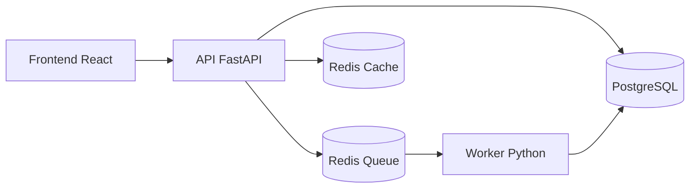

# Guia de Laboratorio Kubernetes - StudyFlow

Este guia foi feito para voce executar o projeto em ordem e enxergar cada conceito do Kubernetes acontecendo de verdade.

## Objetivo do laboratorio

Ao final, voce vai conseguir praticar:

- containers com Docker
- pods
- deployments
- replicas
- services
- configmaps
- secrets
- volumes persistentes
- fila com Redis
- worker assincrono
- escalabilidade horizontal
- port-forward
- logs e troubleshooting

## Arquitetura que vamos observar



## Antes de comecar

Voce precisa ter instalado na sua maquina:

- Docker
- Kubernetes local: Docker Desktop com Kubernetes, Minikube ou Kind
- kubectl

Para checar:

```bash
docker --version
kubectl version --client
```

Se estiver usando Docker Desktop, habilite Kubernetes nas configuracoes.

## Etapa 1 - Entender o que vamos rodar localmente

Entre na pasta do projeto:

```bash
cd /Users/adryan1928/Documents/Programacao/Kubernetes-RabbitMQ-and-GO/kubernetes
```

Veja os blocos principais:

- `backend/`: API FastAPI e worker
- `frontend/`: interface React
- `infra/k8s/`: manifests do Kubernetes
- `docker-compose.yml`: ambiente local completo com containers

## Etapa 2 - Rodar tudo primeiro com Docker Compose

Essa etapa e importante porque o Compose te ajuda a validar a aplicacao antes de entrar no Kubernetes.

Se quiser customizar variaveis:

```bash
cp .env.example .env
```

Suba os containers:

```bash
docker compose up --build
```

O que observar:

- o frontend sobe em `http://localhost:3000`
- a API sobe em `http://localhost:8000/docs`
- o Postgres sobe separado
- o Redis sobe separado
- o worker roda como processo independente

## Etapa 3 - Testar o fluxo da aplicacao

Abra o frontend em `http://localhost:3000`.

Crie um pedido de plano de estudo.

O que acontece por tras:

1. Frontend envia um `POST /jobs`
2. API salva no PostgreSQL com status `pending`
3. API publica o `job_id` no Redis
4. Worker consome da fila
5. Worker altera para `processing`
6. Worker gera o plano e salva como `completed`
7. Frontend atualiza a tela e mostra o resultado

## Etapa 4 - Ver o conceito de containers na pratica

Liste os containers:

```bash
docker ps
```

Voce deve ver algo como:

- frontend
- api
- worker
- redis
- postgres

Aqui voce enxerga a primeira separacao importante: cada responsabilidade esta em um container diferente.

## Etapa 5 - Inspecionar logs

Veja os logs de tudo:

```bash
docker compose logs -f
```

Ou veja so o worker:

```bash
docker compose logs -f worker
```

O que observar:

- o worker fica escutando a fila
- quando voce cria um pedido, ele processa o job
- voce consegue ver a natureza assincrona do sistema

## Etapa 6 - Entrar no Kubernetes

Agora que o fluxo funciona com Docker, vamos para o Kubernetes.

## Etapa 7 - Build das imagens

No diretorio `kubernetes/`, rode:

```bash
docker build -t studyflow-api:latest ./backend -f ./backend/Dockerfile.api
docker build -t studyflow-worker:latest ./backend -f ./backend/Dockerfile.worker
docker build -t studyflow-frontend:latest ./frontend
```

Se estiver usando Kind ou outro cluster que nao enxerga imagens locais, talvez precise carregar as imagens no cluster.

Exemplo com Kind:

```bash
kind load docker-image studyflow-api:latest
kind load docker-image studyflow-worker:latest
kind load docker-image studyflow-frontend:latest
```

## Etapa 8 - Ver os manifests antes de aplicar

Renderize os manifests:

```bash
kubectl kustomize infra/k8s
```

O que observar:

- namespace separado para o projeto
- configmap para configuracoes publicas
- secret para credenciais
- deployment para cada servico
- service para comunicacao interna
- pvc para persistencia do Postgres
- hpa para API e worker

## Etapa 9 - Aplicar tudo no cluster

```bash
kubectl apply -k infra/k8s
```

## Etapa 10 - Ver o namespace

```bash
kubectl get ns
```

O que voce aprende aqui:

- `Namespace` organiza e isola recursos
- tudo do projeto fica dentro de `studyflow`

## Etapa 11 - Ver pods na pratica

```bash
kubectl get pods -n studyflow
```

Depois acompanhe em tempo real:

```bash
kubectl get pods -n studyflow -w
```

O que observar:

- cada pod representa uma instancia de aplicacao
- API e worker podem ter mais de uma replica
- o frontend tem pod proprio
- Redis e Postgres tambem viram pods

## Etapa 12 - Entender Deployments

Veja os deployments:

```bash
kubectl get deployments -n studyflow
```

Descreva um deployment:

```bash
kubectl describe deployment api -n studyflow
```

O que observar:

- numero desejado de replicas
- estrategia de rollout
- template do pod
- labels e selectors

Conceito:

- `Pod` e a unidade que roda o container
- `Deployment` e o controlador que garante que os pods existam

## Etapa 13 - Ver replicas e escalonamento manual

Escalone a API manualmente:

```bash
kubectl scale deployment api --replicas=4 -n studyflow
```

Veja os pods novamente:

```bash
kubectl get pods -n studyflow
```

Depois volte para 2 replicas:

```bash
kubectl scale deployment api --replicas=2 -n studyflow
```

O que observar:

- o Kubernetes cria ou remove pods para bater no numero desejado
- isso mostra a base da escalabilidade horizontal

## Etapa 14 - Ver Services

Liste os services:

```bash
kubectl get svc -n studyflow
```

Descreva o service da API:

```bash
kubectl describe svc api-service -n studyflow
```

O que observar:

- o `Service` cria um endpoint fixo
- os pods podem morrer e renascer, mas o service continua com o mesmo nome
- o frontend conversa com `api-service`, nao com IP de pod

## Etapa 15 - Testar acesso com port-forward

Exponha o frontend:

```bash
kubectl port-forward svc/frontend-service 3000:80 -n studyflow
```

Em outro terminal, se quiser testar a API direto:

```bash
kubectl port-forward svc/api-service 8000:8000 -n studyflow
```

Agora abra:

- `http://localhost:3000`
- `http://localhost:8000/docs`

O que voce aprende:

- `ClusterIP` nao expoe para fora por padrao
- `port-forward` e otimo para estudo e depuracao local

## Etapa 16 - Ver ConfigMap e Secret

Liste:

```bash
kubectl get configmap -n studyflow
kubectl get secret -n studyflow
```

Descreva o ConfigMap:

```bash
kubectl describe configmap studyflow-config -n studyflow
```

Veja o Secret em YAML:

```bash
kubectl get secret studyflow-secret -n studyflow -o yaml
```

O que observar:

- `ConfigMap` guarda configuracoes nao sensiveis
- `Secret` guarda informacoes sensiveis
- ambos entram como variaveis de ambiente nos containers

## Etapa 17 - Ver volumes persistentes

Liste PVCs:

```bash
kubectl get pvc -n studyflow
```

Descreva o PVC:

```bash
kubectl describe pvc postgres-pvc -n studyflow
```

O que observar:

- o PostgreSQL precisa persistir dados
- sem volume, perderia tudo ao recriar o pod

Experimento:

1. Crie alguns pedidos pelo frontend
2. Delete so o pod do Postgres
3. Veja se os dados continuam

Comando:

```bash
kubectl delete pod -l app=postgres -n studyflow
```

Depois confira se o novo pod sobe e os dados ainda existem.

## Etapa 18 - Ver logs no Kubernetes

Logs da API:

```bash
kubectl logs -l app=api -n studyflow --tail=100
```

Logs do worker:

```bash
kubectl logs -l app=worker -n studyflow --tail=100
```

Seguir logs do worker:

```bash
kubectl logs -f -l app=worker -n studyflow
```

O que observar:

- o worker realmente processa em segundo plano
- voce vai ver quando um job e consumido e finalizado

## Etapa 19 - Entrar dentro de um pod

Pegue o nome de um pod:

```bash
kubectl get pods -n studyflow
```

Entre em um pod da API:

```bash
kubectl exec -it <nome-do-pod> -n studyflow -- sh
```

La dentro, voce pode verificar variaveis de ambiente:

```bash
env | sort
```

O que voce aprende:

- como o container esta rodando por dentro
- como ConfigMap e Secret chegam ao processo

## Etapa 20 - Ver labels e seletores

Mostre os pods com labels:

```bash
kubectl get pods -n studyflow --show-labels
```

O que observar:

- Services e Deployments conectam recursos usando labels e selectors
- isso e uma base muito importante do Kubernetes

## Etapa 21 - Deletar um pod e ver auto-recuperacao

Delete um pod da API:

```bash
kubectl delete pod -l app=api -n studyflow
```

Observe:

```bash
kubectl get pods -n studyflow -w
```

O que voce aprende:

- o pod morre
- o Deployment detecta isso
- um novo pod e criado automaticamente

Esse e um dos conceitos mais importantes do Kubernetes: o estado desejado e mantido pelo controlador.

## Etapa 22 - Entender o worker na pratica

Com o frontend aberto, crie varios pedidos em sequencia.

Observe os logs do worker e os pods:

```bash
kubectl logs -f -l app=worker -n studyflow
kubectl get pods -n studyflow
```

O que voce vai enxergar:

- a API nao fica lenta esperando o processamento acabar
- os jobs ficam na fila
- workers consomem os jobs
- se houver mais carga, faz sentido aumentar replicas do worker

Isso mostra por que o worker e ideal para tarefas demoradas.

## Etapa 23 - Escalar o worker manualmente

```bash
kubectl scale deployment worker --replicas=4 -n studyflow
```

Agora gere mais pedidos.

O que observar:

- mais workers podem consumir mais jobs em paralelo
- esse e o ganho real da arquitetura orientada a fila

## Etapa 24 - Ver o HPA

Liste:

```bash
kubectl get hpa -n studyflow
```

Descreva um deles:

```bash
kubectl describe hpa worker-hpa -n studyflow
```

O que observar:

- minimo e maximo de replicas
- metrica de CPU configurada
- alvo de utilizacao

Observacao importante:

- para o HPA funcionar de verdade, o cluster precisa do Metrics Server
- em alguns clusters locais ele nao vem pronto

## Etapa 25 - Ver rollout e atualizacao

Reaplique um manifest alterado:

```bash
kubectl apply -k infra/k8s
```

Acompanhe rollout:

```bash
kubectl rollout status deployment/api -n studyflow
```

Veja historico:

```bash
kubectl rollout history deployment/api -n studyflow
```

O que voce aprende:

- como o Kubernetes atualiza pods sem derrubar tudo de uma vez

## Etapa 26 - Troubleshooting basico

Se algo falhar, siga esta ordem:

1. Ver pods
```bash
kubectl get pods -n studyflow
```

2. Descrever pod com problema
```bash
kubectl describe pod <nome-do-pod> -n studyflow
```

3. Ver logs
```bash
kubectl logs <nome-do-pod> -n studyflow
```

4. Ver eventos recentes
```bash
kubectl get events -n studyflow --sort-by=.metadata.creationTimestamp
```

## Etapa 27 - Limpar o laboratorio

Para remover tudo:

```bash
kubectl delete -k infra/k8s
```

Se quiser parar o ambiente Docker Compose:

```bash
docker compose down
```

Se quiser apagar tambem o volume local do Postgres no Compose:

```bash
docker compose down -v
```

## Ordem ideal de estudo

Se quiser aprender com mais clareza, siga esta ordem mental:

1. Container
2. Pod
3. Deployment
4. Replica
5. Service
6. ConfigMap e Secret
7. Volume persistente
8. Queue e worker
9. Escalabilidade manual
10. HPA
11. Logs e troubleshooting

## Perguntas que vale responder enquanto pratica

- O que fica no pod e o que fica no deployment?
- Por que o frontend acessa um service e nao um pod?
- Por que o worker nao deveria ficar dentro da API?
- O que acontece se um pod morrer?
- O que acontece se o Postgres nao tiver volume?
- Em que situacao eu escalaria API e em que situacao eu escalaria worker?

## Sugestao de rotina de pratica

Faca o laboratorio em 3 blocos:

- Bloco 1: Docker Compose e entendimento da arquitetura
- Bloco 2: Pods, Deployments, Services, ConfigMaps, Secrets e PVC
- Bloco 3: Worker, fila, escalabilidade e HPA

Se voce quiser, na proxima etapa eu posso te guiar ao vivo pelo **Bloco 1**, com os comandos exatos e o que voce deve observar em cada saida.
